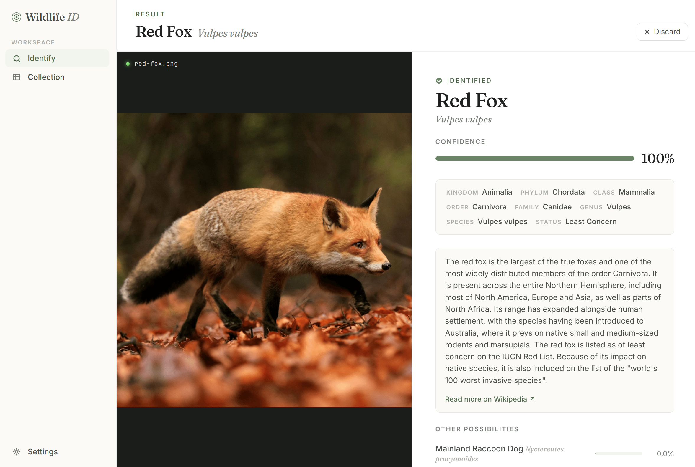
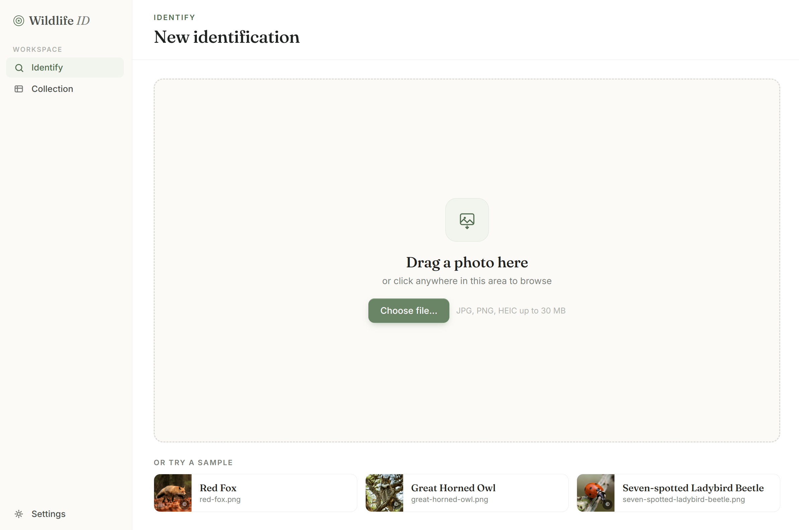
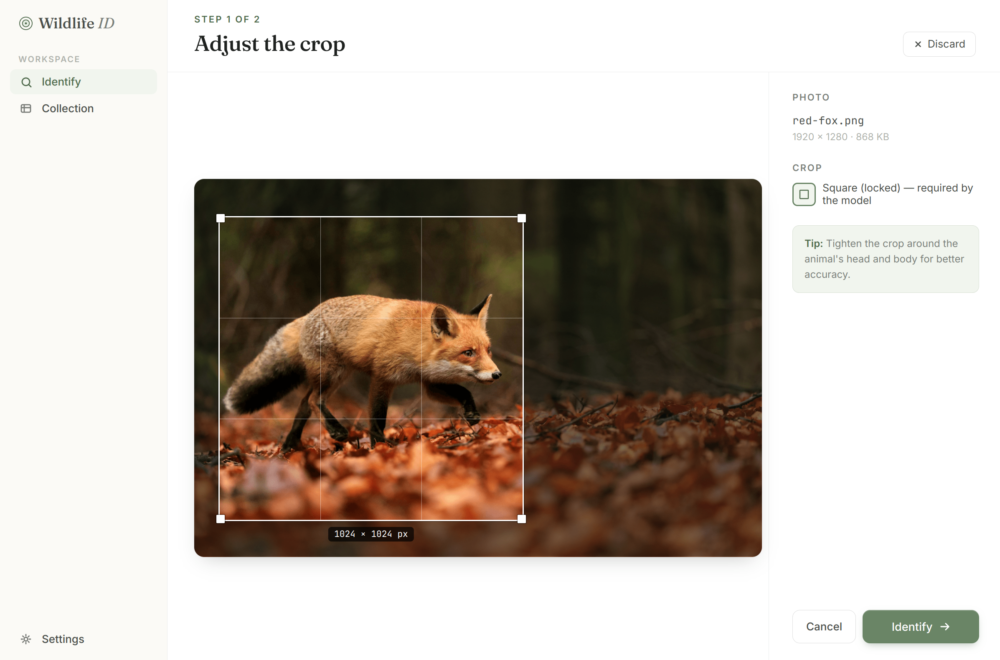
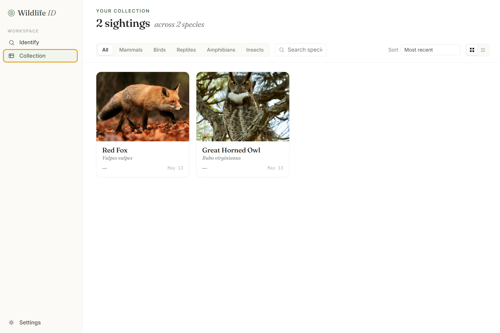

# Wildlife ID

**Identify any animal from a single photo. Completely offline, no account required.**

Wildlife ID is a free, open-source desktop app powered by [BioCLIP](https://imageomics.github.io/bioclip/). Drop in a photo, get the species name, confidence score, taxonomy, and IUCN conservation status in seconds. Everything runs locally on your machine after a one-time model download.

---

 

---

## Download

**[→ Download the latest release](https://github.com/Jego-M/wildlife-id/releases/latest)**

| Platform | Format |
|----------|--------|
| Windows 10+ | `.exe` installer |
| macOS 12+ | `.dmg` |
| Linux (Ubuntu 22.04+) | `.AppImage` / `.deb` |

SHA-256 checksums are attached to every release. Model weights (~600 MB for Fast, ~1.7 GB for Accurate) download automatically on first launch, they are not bundled in the installer.

### First-launch note for macOS

Gatekeeper will block the app because it isn't code-signed. To open it:

1. Right-click the app in Finder → **Open** → **Open** in the dialog, or
2. Run once in Terminal: `xattr -d com.apple.quarantine /Applications/WildlifeID.app`

This only needs to be done once.

### First-launch note for Windows

SmartScreen may show "Windows protected your PC." Click **More info → Run anyway**.

---

## Features

- **Identify** any animal from a JPEG, PNG, WEBP, or TIFF photo
- **Crop tool** ->  draw a tight rectangle around the subject before identifying for best results
- **Top 3 candidates** -> the 3 most likely matches are displayed with confidence scores
- **Taxonomy & conservation status** -> Kingdom, Class, Family, and IUCN Red List category shown for every result
- **Personal collection** -> save identifications with notes, date observed, and location
- **Two models** -> Fast (BioCLIP v1, ~1–2 s/image) and Accurate (BioCLIP 2, ~3–6 s/image), switchable in Settings
- **Fully offline** -> after the initial model download nothing ever leaves your computer


---
 
 
 

---

## System requirements

- 8 GB RAM minimum
- ~1 GB free disk space for the Fast model, ~2.5 GB for Accurate
- Works on CPU.

---

## How it works

Wildlife ID uses [BioCLIP](https://imageomics.github.io/bioclip/), a vision-language model trained on 10 million wildlife images from the Tree of Life dataset. At inference time, your photo is encoded and compared against pre-computed text embeddings for ~420,000 animal species. The closest matches become your top results.

All inference runs locally. No photos are uploaded anywhere.

---

## Contributing

Contributions are welcome: bug reports, common name corrections, platform fixes, or new features.

**Quick start:**

```bash
git clone https://github.com/Jego-M/wildlife-id
cd wildlife-id
npm install
python3 -m venv .venv
.venv/bin/pip install -r src/backend/requirements.txt
# Install PyTorch for your hardware — see CONTRIBUTING.md
npm run dev
```

See [CONTRIBUTING.md](CONTRIBUTING.md) for the full setup guide, code style, and how to build installers.

---

## License

MIT — see [LICENSE](LICENSE).

Powered by [BioCLIP](https://huggingface.co/imageomics/bioclip) (MIT). Trained on the TreeOfLife-200M dataset, which incorporates iNaturalist research-grade observations.

